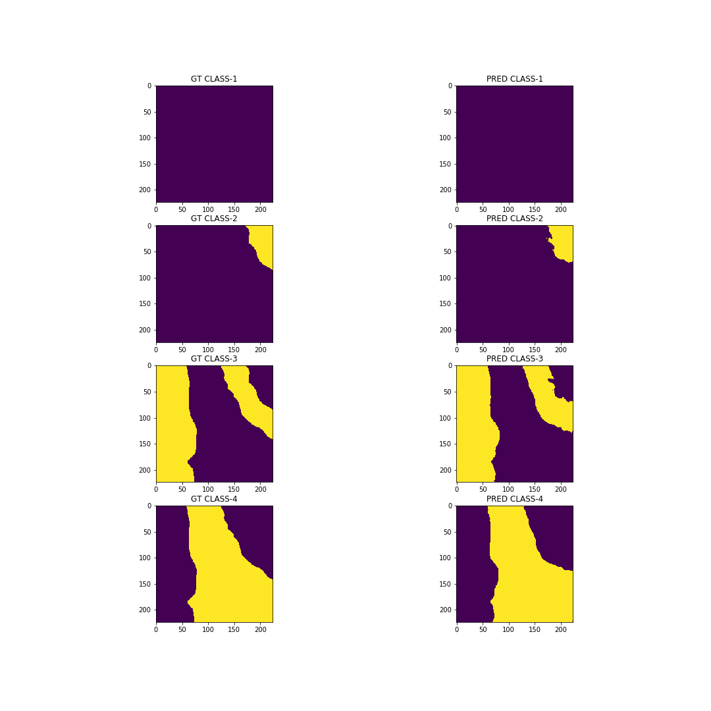

## Overview
The task is to classify each pixel belonging to a particular label of four different classes of the 
histopathology images. The datasets provided 6 images and its corresponding labels. In order 
to perform pixel wise segmentation, the popular ​ U-Net architecture​ has been deployed. The loss 
function is the weighted average of ​ binary cross entropy loss​ and d
ice loss​ . 

## Data preparation
The proposed framework is evaluated on 6 histopathology images. The experiments involved 
splitting these images into non-overlapping training and validation folds. For training 5 images 
have been chosen and 1 left out image considered for testing. Each image is of size 1906 × 896 
px. In our experiment, I have cropped images to a size of 224 × 224 px with an overlap of 112 px. 
In order to generate more images for training, patches of size 224 x 244 px. has been extracted 
from the random locations followed with multiple data-augmentations, which resulted in 5000 
images of size 224 x 224 px from a single large size image. In this way, from 5 training images, 
25000 images have been extracted for training. From the single validation image, 24 
non-overlapping patches of 224 x 224 px have been used for validation purposes.

## Experimental Settings 
Further, we resize all images into the standard size of 224×224 px. RGB color images to be 
consistent with proposed architecture. The hyper-parameters in loss function were set as 0.5, in 
order to give similar weitages to both the loss functions (dice and entropy loss). The Adam 
optimizer is used for learning with the batch size of 5. The learning rate set is initially set to
0.001 which was decayed by 10% over 25 epochs. All the experiments were run on a laptop 
with Intel i7 processor, with single GeForce GTX 1050 Ti Mobile with 4 GB DDRS RAM and 16 
GB of system RAM. Ubuntu 16.04 LTS was the OS and the experiments were implemented on 
PyTorch. The evaluation metrics used to quantify classification performance is dice loss. 

## Discussion of Results 
we observe a sharp fall in loss curve of training and validation datasets in the first 8 epochs. 
This improvement of the classification performance of the proposed large size CNN framework 
with limited training data, endorses the importance of the on the fly data augmentations, the 
proposed loss function and proper settings of the free parameters.

*Fig. 1. Training and validation loss curve. Plot is the loss curve of entropy and dice loss combined.*

We observe the loss curve starts fluctuating after the 8-th epochs on ward, due to high learning 
rate (0.001). In order to solve this issue, we took the best validation model (that we found at 
epoch 8-th), and started the 2nd round of training with a low learning rate (0.00001). Fig. 2 
showcases the training and validation loss curve with the specified setting. This is significantly 
better than the previous loss curve. Fig. 3 portrays the ground truth and the predicted output of 
the model wrt to each class on a validation data.

*Fig. 2. Loss curve with learning rate 0.00001.*

*Fig. 3. Ground truth vs predicted results of a validation patch.*
